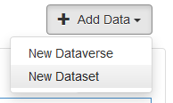
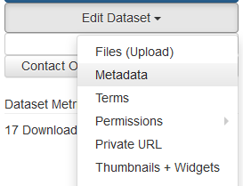

# Adding data to Abacus
Datasets in Abacus are grouped into collections, sometimes referred to as _dataverses_. The collection a dataset belongs to determines which users can access it. Data added to the [UNBC Library licensed data](https://abacus.library.ubc.ca/dataverses/uvic) collection may be downloaded by users who authenticate with UNBC credentials, but not by members of the public. Data added to the [Open data](https://abacus.library.ubc.ca/dataverse/open) collection is available to everyone under open license terms.

!!! Info
    The term _dataverse_ appears throughout the Abacus interface, particularly on pages for admin users. Abacus is an instance of the [Dataverse application](https://dataverse.org/about), an open source data repository, but the term can also refer to a collection of datasets _within_ Abacus 

## Who can add data?
Users with administrative accounts may add datasets to Abacus that conform to the collection policy. Questions about the suitability of a dataset can be directed to <mailto:abacus.support@ubc.ca>. 

| Data contributor | Where they can add data
| --- | ---
| Data librarian from an Abacus member organization | Data collection for the member organization, e.g. [SFU Library licensed data](https://abacus.library.ubc.ca/dataverse/sfu)
| Representative for a non-library UBC department | Data collection for the UBC department, e.g. [Campus and Community Planning](https://abacus.library.ubc.ca/dataverse/ccp)
| UBC Library data team | Any collection; _the data team hosts and manages Abacus_

## Create a new dataset
This section describes how to create a dataset using the Abacus user interface, the easiest method for beginners or those who rarely add data. Users who add data often may wish to consult the API and [Dataverse utilities](../dataset_code/dataverse_utils/docs) sections for ways to automate parts of the process.  

1. Navigate to the collection/dataverse where you would like to add data.  

2. Click the _Log In_ link in the top right, select your instution from the drop-down menu, and login with your institutional credentials.

3. Click the _Add Data_ button on the right and select _New Dataset_ from the drop-down menu.
    

4. Complete the _Citation Metadata_ portion of the form, ensuring all mandatory fields are filled.

5. Add dataset files in the _Files_ portion of the form, near the bottom of the page.
    
    !!! Warning
        .zip files will automatically be unzipped during the upload process. This is a convenient way to add many files at once, but it's not always the desired behaviour. If you would like the file to remained zipped in the Abacus record, zip the zip file a second time before upload.
    
6. Click _Save Dataset_. 

7. **Optional:** after saving, click _Edit dataset_ and select _Metadata_ from the dropdown. This will open an expanded form with additional metadata fields not shown on the first page. Fill additional metadata fields as desired, then save again.
    

8. Use the _Edit dataset_ drop-down options to update files and metadata as desired. The data will not be visible to end users until the dataset is published, so you can experiment without affecting anyone. 

9. When the dataset is ready, click _Publish dataset_ to make it available to Abacus users. The dataset will be published as version 1.0.

