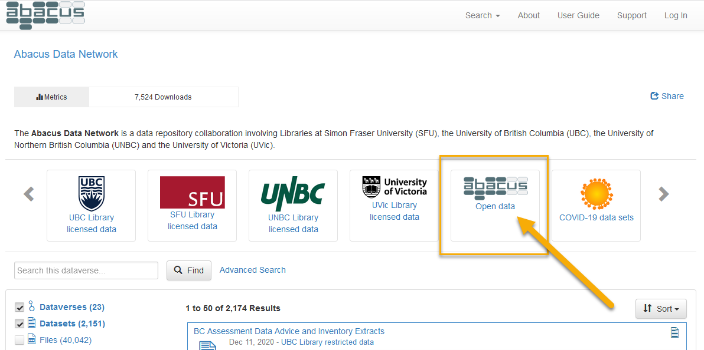

# User guide

While Abacus is designed to be as easy to use as possible, searching for and using data is complex by its very nature. To help you start to navigate Abacus, here are some basic instructions on key activities and functions. If you already know the basics and wish to explore further, please see the [search syntax](https://ubc-library-rc.github.io/abacus/en/guides/user/search) page and the [Advanced User's Guide](https://guides.dataverse.org/en/5.6).

## Login

### Your first login

If you have never logged in to Abacus, when you log in for the **first time** from your institutional web page, you will be taken to the account creation page. Abacus will automatically create an account which uses information provided by your institution.

Verify that your account details are correct and confirm them.

Click on the *Abacus* logo at the top left of the page, and you will be able to use the Abacus service.

!!! info
    You will only need to perform the above on your very first login.

The primary *Abacus* web page is located at <https://abacus.library.ubc.ca>. Anyone may search *Abacus* and view the data descriptions but many data files can only be accessed by users affiliated with SFU, UBC, UNBC, or UVic. To work with these licensed files you will need to **log in** with your university credentials. 

If you have come directly to the *Abacus* home page, as opposed to navigating from your institution's library web site, follow these instructions to **log in**:

=== "SFU, UBC, and UNBC users" 
    Use the **Log In** link at the extreme right of the top menu bar.

    {: .guide_image} 

    By default, you will be presented with a drop down list showing SFU, UBC, and UNBC. Select your institution and login using the credentials supplied by your university, such as the Campus-wide Login (CWL) used at the University of British Columbia.

    {: .guide_image} 

    
    If the drop-down list of institutions is not visible and you are being prompted for username/password authentication, you will see **Other options**  underneath the dialogue boxes, with a button labelled **Your Institution**. Clicking on this button will produce the drop-down list as described above.
    
    {: .guide_image} 
    
    **It is not necessary to select a username/password for Abacus**, an account will be created for you the first time you login. Your institutional login ID is all that is required to access and download files to which your university has access. 

=== "UVic users"
    [Login here](https://login.ezproxy.library.uvic.ca/login?url=https://abacus.library.ubc.ca/dataverse/uvic) using your university credentials. After login you will be redirected to the UVic collection in Abacus.

## Search
This section introduces Abacus search options. For more information see the [search syntax](https://ubc-library-rc.github.io/abacus/en/guides/user/search) page.

### Default search
Searching is possible from almost anywhere inside Abacus. From the main page at <https://abacus.library.ubc.ca>, the search feature will search the *entire* contents of Abacus, including material to which your institution may not have access.

{: .guide_image} 

To easily limit your search to material to which your account has access, select your university from the icons at the top of the page.

{: .guide_image} 

To limit your search to material that is available to the public without login, select the [Abacus Open Data](https://abacus.library.ubc.ca/dataverse/abacus-open) icon.

{: .guide_image} 

Should your search produce too many results, it can be narrowed by selecting the facets on the left side of the page, such as "Producer Name".

{: .guide_image} 

Facets may also be discarded once applied by clicking on them after they appear at the top of the search results.

{: .guide_image} 

#### Selected search tips
- **Boolean operators**. By default, search terms are connected with the Boolean `OR` operator. Use `AND` between search terms if you would like results to contain _all_ your terms: e.g. `adult AND literacy AND education`.
- **Searching for phrases**. Enclose search terms in double quotation marks to find records that contain the exact phrase: e.g. `"adult literacy"`. Be careful not to inadvertently exclude material of interest: for example, a search for `"adult literacy survey"`  will return the *International Adult Literacy Survey (IALS)*, but not the *Adult Literacy and Life Skills Survey*.
- **Wildcards**. Abacus supports single- and multiple-character wildcards:
	- `?` to match one character. `?oom` matches "zoom", "room", and "boom", but not "broom".
	- `*` to match zero or more characters. `revolution*` matches "revolution", "revolutionary", and "revolutionaries".

!!! info 
    Wildcard operators function only on terms, not phrases.

For more detail and additional tips see [Search syntax](#search-syntax).

### Advanced search

The **Advanced** search will allow you to search by very specific individual fields and to **search within the data itself** for applicable datasets. Note that not all datasets have variable-level searching implemented, nor does every study in Abacus have every field filled, as some values are not applicable to some types of datasets.

### Local vs global search 
Abacus supports two distinct **search scopes**: "global" and "local". Using the search box on the left-hand side of the user interface will limit results to the dataverse currently selected (a "local" search), while using the search box through selecting the "Search" drop-down menu at the top of the user interface will execute a query on all dataverses in the Abacus Data Network (a "global" search, as shown below).

{: .guide_image} 

## Search syntax
### Boolean logical operators
**Boolean logical operators** greatly improve the power and efficiency of queries. By default, search terms are connected with the Boolean `OR` operator. Thus, the search `adult literacy survey` will match material containing "adult", "literacy", or "survey", but not necessarily all three. For results that contain all search terms, use the `AND` operator: `adult AND literacy AND survey`. 

In addition to the `AND` and `OR` operators, other useful Boolean operators include `NOT`, `+`, and `-`. 

The `NOT` and `-` operators function similarly, requiring that the term following the operator not be present in search results, while the `+` operator requires that the term is present. For instance, `literacy NOT child`, or `literacy -child`, will return all results containing "literacy" without the term "child", while `+"adult literacy" survey` returns results with the phrase "adult literacy" that may or may not contain the term "survey".

In addition to their word form, Boolean operators can also be called in symbol form:

Word | Symbol
--- | ---
AND | &&
OR | \|\|
NOT | !

!!! info 
    To use Boolean operators in word form (e.g. `AND`, `OR`, `NOT`), all letters must be uppercase. Additionally, when using the `!` operator, unlike its word form `NOT`, do not include a space before the term it applies to.

	**correct:** `education !primary`  
	**incorrect:** `education ! primary`.

For added control over the Boolean logic of a search, users can **group clauses to form sub-queries** using parentheses. Searching for `vaccine AND ("corona virus" OR "COVID-19")` will return material that matches either "vaccine" and "corona virus" or "vaccine" and "COVID-19".

### Querying specific fields
Users can also narrow their search within Abacus by **querying specific fields**. The syntax for this requires, first, specifiying the field to be searched (e.g. `title`), followed by a `:`, and then the term to search for: `title:financial`. (NOTE: There is no space between the colon and the search term. )

Searching for multiple terms within a field requires specifying the field before each term. For example, the sytnax for searching for the terms "labour", "force", and "survey" within the "title" field is `title:labour AND title:force AND title:survey`. Using the query `title:labour force survey` will search for "labour" in the "title" field and "force" and "survey" in any other metadata field. To search for the phrase "labour force survey" in the "title" field, wrap the phrase in double quotation marks: `title:"labour force survey"`.

### Specifying a date range
Searching by **specifying a date range** can also be an effective way to find data. Range syntax is denoted in Abacus as `[ TO ]`, where both a lower and upper bound are specified. Different types of brackets indicate whether these bounds are inclusive or exclusive. Square brackets `[]` represent inclusive lower and upper bounds, whereas curly brackets `{}` represent exclusive bounds. These can be combined in a single query: `{1956-02-16 TO 1988-05-03]`.

Dates in Abacus are formatted as `YYYY-MM-DD`, where:  

- `YYYY` is the year,
- `MM` is the month,
- `DD` is the day of the month,

**Truncation:** Users do not need to specify complete dates and times to search using date ranges. For instance, the search `pubdate:[1956 TO 1998-05]` using the "publication date" field will produce relevant material from (and including) 1 January 1956 through 31 May 1998.

**Wildcard:** You may use the `*` wildcard as the lower or upper bound. Entering `[* TO 2001-09-11}` would return all matched items from the earliest in the repository up to (but excluding) 11 September 2001, whereas entering `[2001-09-11 TO *]` would return all matched items from (and including) 11 September 2001 up to the most recent matched deposit.

## Download

Once you've found a data set in the search, click on the title and you'll be taken to its page. By default, you are taken to a short display with an abstract and a listing of files. For each file, you may have several options, depending on its type.

* To quickly download the file, click on the **Download** button

* For statistical files which are available for online analysis, you can view their contents and download in a variety of formats by using the **Explore** button. You will also be able to view summary statistics for these data sets and create cross-tabulations, as well as search within the data set itself at the variable level.

### Linking and downloading individual files

* To see a preview (if available), permanent URL and other metadata for a particular file, click on the **filename**. The next page will provide citations for both the data set and the individual *file*, as well as a record of any changes to the file itself. The file may be downloaded by clicking the **Download** button. The metadata tab will may also provide a direct download link (if available), and display an md5 checksum should you wish to verify your download.

If there is no direct download link, and programmatic access is required, the using the equivalent of the following `curl` commands will allow direct download.

#### Publicly accessible data files

As an example, the [2020 Labour Force Survey](https://dvn.library.ubc.ca/dataset.xhtml?persistentId=hdl:11272.1/AB2/GGXMM2&version=2.0) data:

File page for the **August 2020 ASCII data**:

`https://dvn.library.ubc.ca/file.xhtml?persistentId=hdl:11272.1/AB2/GGXMM2/KMGN1A&version=2.0`

To download this file:

`curl "https://abacus.library.ubc.ca/api/access/datafile/:persistentId/?persistentId=hdl:11272.1/AB2/GGXMM2/KMGN1A" -o micro2020-08.zip"`

#### Licensed data

To download licensed data, you will need an API token (see the [Advanced User's Guide](http://guides.dataverse.org/en/5.6))

As an example, the [CanMap Content Suite, v2019.3](https://dvn.library.ubc.ca/dataset.xhtml?persistentId=hdl:11272.1/AB2/PCTBFN&version=1.0):

File page for the **WatershedsRegion.zip** file:

`https://dvn.library.ubc.ca/file.xhtml?persistentId=hdl:11272.1/AB2/PCTBFN/IBVPVN&version=1.0`

To download this file:

`curl -H "X-Dataverse-key: YOURAPITOKEN" "https://abacus.library.ubc.ca/api/access/datafile/:persistentId/?persistentId=hdl:11272.1/AB2/PCTBFN/IBVPVN" -o WatershedsRegion.zip`

Where YOURAPITOKEN is your account's API token.

### Bulk downloads

To download multiple files at once, select the checkbox at the left of the top row of the file table. This will automatically select all of the files in the study. Download the files using **Download** button on the top row of the table. 

For data sets with very large files, such as the geospatial datasets from *DMTI Spatial Inc.* or compilations of lidar or orthoimagery, downloads may be truncated due to size limits on zip files. Other download options are available, such as API based downloads (as per the [Advanced User's Guide](http://guides.dataverse.org/en/5.6)).

## Metadata

To view the metadata or detailed description of the material in Abacus, select the **Metadata** tab of the data set in which you are viewing. By default, citation metadata is visible, with other sections of metadata (such as Geospatial data) is only visible after clicking on the appropriate button. 

For many social science data sets, much of the metadata will be stored in the *Social Science and Humanities Metadata* section, such as sample information, etc.

Study metadata can be exported in a variety of formats for use in other applications by selecting the format desired from the **Export Metadata** button found just above the citation metadata. Some formats can be used with citation managers, such as DataCite and Dublin Core, but import formats are dependent entirely on the citation manager software.

## Help/support

For more detailed information beyond this brief guide, please see the [Advanced User's Guide](http://guides.dataverse.org/en/5.6), which will give a detailed overview of the use of Dataverse, the software which powers Abacus.

Support within Abacus itself is available as well. For email assistance, use the **Support** link in the interface menu bar.

For support with specific data sets, or to report errors and technical issues, within each record you can use the **Contact** button just above and to the right of the dataset title. Note that in most cases, the **Support** and **Contact** buttons will be sent to the same people, ie *Abacus Support*.
